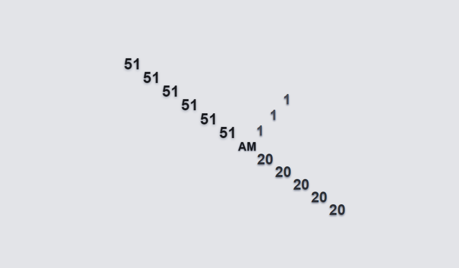
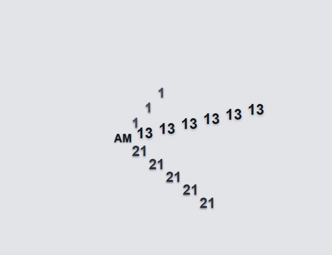
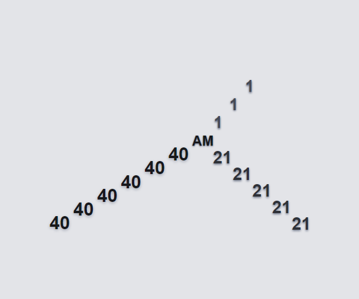

# Animated Clock Project

This project is an animated clock implemented using HTML, CSS, and JavaScript. The clock displays the current time with smoothly animated hour, minute, and second hands. Additionally, it adapts to both light and dark themes based on the user's system settings.

## Table of Contents
- [Features](#features)
- [Project Structure](#project-structure)
- [Usage](#usage)
- [Components](#components)
- [Screenshots](#screenshots)

## Features
- Displays current time with animated hour, minute, and second hands.
- Responsive design with scalable font size.
- Smooth transitions and animations for clock hands.
- Adaptable to light and dark themes.

## Project Structure
Animated Clock Project
│
├── index.html
├── style.css
└── script.js

php
Copy code

- `index.html`: The HTML file contains the structure of the clock.
- `style.css`: The CSS file styles the clock, including handling themes and animations.
- `script.js`: The JavaScript file updates the clock hands and manages the animations.

## Usage
1. Clone the repository.
2. Open `index.html` in your preferred web browser.
   
 

